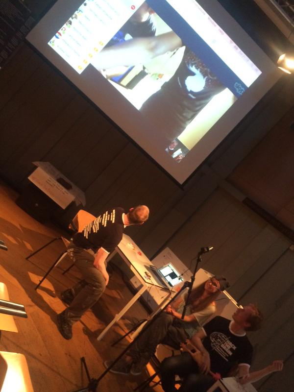

# TransAtlantic_BioData
This repo contains all of the code to send OpenBCI biosignals from the Processing GUI via a TCP socket to another computer via the Internet. It will first be tested by hackers at the BCI Montreal and [Hack The Brain Amsterdam](http://www.hackthebrain.nl) hackathons, that are happening simultaneously. 

## Files

* **Processing/OpenBCI_GUI_EMG** — this Processing code acts as the EMG receiver and signal processor from the OpenBCI board. It also broadcasts the data over TCP to the machine running **NetBridge_Receiver**.
* **Processing/NetBridge_Receiver** — this Processong code acts as the data receiver. Currently, it maps a pseudo-analog range of values onto the opacity of the background... it will soon send the data over serial to the Arduino with a HHI shield. 
* **Arduino/HHI** — This Arduino code takes the serial data from **NetBridge_Receiver** and triggers the HHI to either send a current or not to the wearer's arm. This script accepts values between 0 and 100 over serial.
* **Arduino/Relay-Control** - Simple Arduino code to control a [Sparkfun Relay Board](https://www.sparkfun.com/products/11042) that switches a TENS. Only accepts "0" or "1" over serial.

## Steps for remote EMG TENS control 

1. Setup Hamachi (get "IP")
	a. Get LogMeIn Hamachi: [https://secure.logmein.com/products/hamachi/download.aspx](https://secure.logmein.com/products/hamachi/download.aspx)
	b. Either one of the two parties has to set up a server. Give the credentials to the other parties and establish the network connection.
c. To test the connection, you can for example use a simple demo script: SharedCanvas[Client](https://github.com/processing/processing/tree/master/java/libraries/net/examples/SharedCanvasClient) and [Server](https://github.com/processing/processing/tree/master/java/libraries/net/examples/SharedCanvasServer)
2. OpenBCI_GUI_EMG will read the action potential from a subjects are and pass it along to NetBridge Receiver
    a. Wire up two electrodes (channel 3 top and bottom) to your arm and a third from the elbow to the Ground.
    b. Start the NetBridge Receiver on the receiving PC. A blank canvas should appear.
    c. Look up the IP of the receiving PC in the Hamachi console and past it on line 230 of OpenBCI_GUI_EMG
    d. Start running the OpenBCI_GUI_EMG
    e. Change the settings of channel 3 to "Do not include Bias" and switch SRB2 off. Set BP filter to 5-50Hz and change Notch according to your power net (50 in case you are on 230V 50Hz AC power)
    f. Whenever the sender is flexing his arm muscle, the canvas of the receiver should change color.
3. The NetBridge_Receiver transfers the received value to the Arduino, running HHI or Relay-Control
    a. Based on the received value, the Arduino decides to switch a digital pin to HIGH or LOW
4. HHI or Relay-Control enable the current to flow through the Hand Setup (adjust values... be careful...)
    a. In Amsterdam we used the [Intelect NMES](http://www.fysiosupplies.nl/fysiotechniek/mobiele-tens/intelect-nmes-draagbaar), cut the wire to one of the electrodes and connect that to the [Sparkfun Relay Board](https://www.sparkfun.com/products/11042). Start with the lowes values.
5. TransAtlantic BioData Time! Set up a Skype connection and enjoy!

*Špela Petrič, Pieter van Boheemen, Conor Russomanno and Yannick Roy transatlantic interconnected arms and brains*
